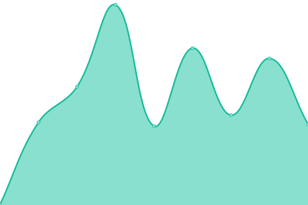
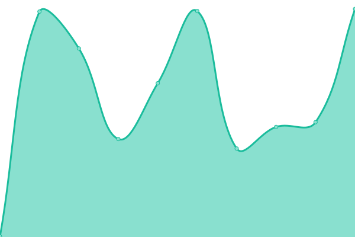
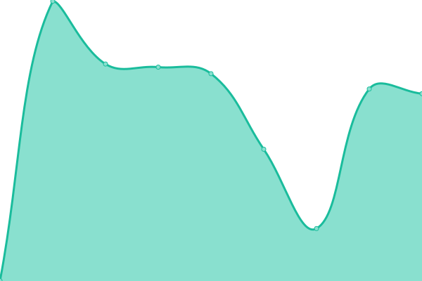
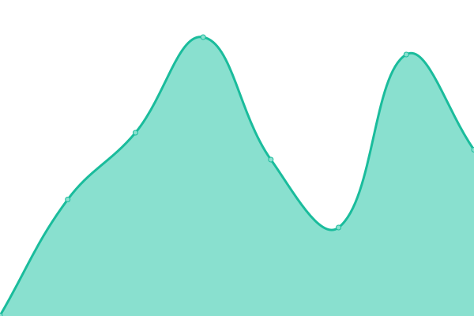
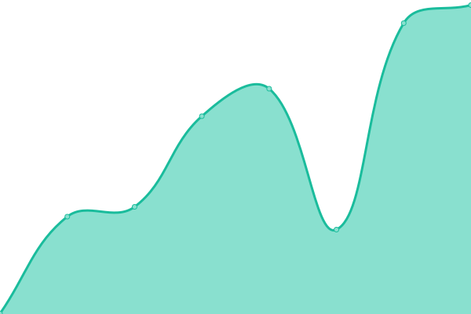
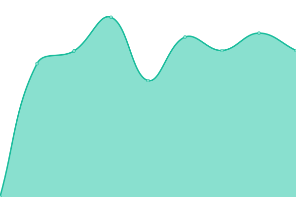
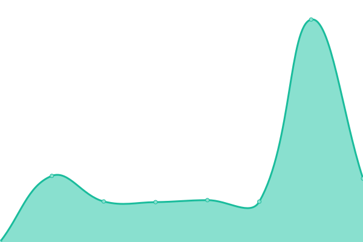
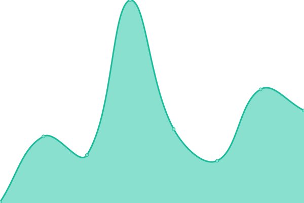

# [📈 Live Status](https://glinet-uptime.admon.in.ua): <!--live status--> **🟩 All systems operational**

This repository contains the open-source uptime monitor and status page for [Aaron Viehl](https://singleton-factory.de), powered by [Upptime](https://github.com/upptime/upptime).

With [Upptime](https://upptime.js.org), you can get your own unlimited and free uptime monitor and status page, powered entirely by a GitHub repository. We use [Issues](https://github.com/admonstrator/glinet-uptime/issues) as incident reports, [Actions](https://github.com/admonstrator/glinet-uptime/actions) as uptime monitors, and [Pages](https://glinet-uptime.admon.in.ua) for the status page.

<!--start: status pages-->
<!-- This summary is generated by Upptime (https://github.com/upptime/upptime) -->
<!-- Do not edit this manually, your changes will be overwritten -->
<!-- prettier-ignore -->
| URL | Status | History | Response Time | Uptime |
| --- | ------ | ------- | ------------- | ------ |
|  [GLDDNS DNS Server](ns1.glddns.com) | 🟩 Up | [glddns-dns-server.yml](https://github.com/Admonstrator/glinet-uptime/commits/HEAD/history/glddns-dns-server.yml) | 

 185ms
     
 | 

<a href="https://glinet-uptime.admon.in.ua/history/glddns-dns-server">100.00%</a>
    

|  [GLDDNS DNS Server](ns2.glddns.com) | 🟩 Up | [glddns-dns-server.yml](https://github.com/Admonstrator/glinet-uptime/commits/HEAD/history/glddns-dns-server.yml) | 

 185ms
     
 | 

<a href="https://glinet-uptime.admon.in.ua/history/glddns-dns-server">100.00%</a>
    

|  [GL.iNet Website (Global)](https://www.gl-inet.com) | 🟩 Up | [gl-i-net-website-global.yml](https://github.com/Admonstrator/glinet-uptime/commits/HEAD/history/gl-i-net-website-global.yml) | 

 557ms
     
 | 

<a href="https://glinet-uptime.admon.in.ua/history/gl-i-net-website-global">100.00%</a>
    

|  [GL.iNet Forum (Global)](https://forum.gl-inet.com) | 🟩 Up | [gl-i-net-forum-global.yml](https://github.com/Admonstrator/glinet-uptime/commits/HEAD/history/gl-i-net-forum-global.yml) | 

 443ms
     
 | 

<a href="https://glinet-uptime.admon.in.ua/history/gl-i-net-forum-global">100.00%</a>
    

|  [GL.iNet Forum (China)](https://forum.gl-inet.cn) | 🟩 Up | [gl-i-net-forum-china.yml](https://github.com/Admonstrator/glinet-uptime/commits/HEAD/history/gl-i-net-forum-china.yml) | 

 1965ms
     
 | 

<a href="https://glinet-uptime.admon.in.ua/history/gl-i-net-forum-china">100.00%</a>
    

|  [GL.iNet Docs](https://docs.gl-inet.com) | 🟩 Up | [gl-i-net-docs.yml](https://github.com/Admonstrator/glinet-uptime/commits/HEAD/history/gl-i-net-docs.yml) | 

 339ms
     
 | 

<a href="https://glinet-uptime.admon.in.ua/history/gl-i-net-docs">100.00%</a>
    

|  [GL.iNet Firmware Website](https://dl.gl-inet.com) | 🟩 Up | [gl-i-net-firmware-website.yml](https://github.com/Admonstrator/glinet-uptime/commits/HEAD/history/gl-i-net-firmware-website.yml) | 

 290ms
     
 | 

<a href="https://glinet-uptime.admon.in.ua/history/gl-i-net-firmware-website">100.00%</a>
    

|  [Firmware Update Server](https://fw.gl-inet.com) | 🟩 Up | [firmware-update-server.yml](https://github.com/Admonstrator/glinet-uptime/commits/HEAD/history/firmware-update-server.yml) | 

 329ms
     
 | 

<a href="https://glinet-uptime.admon.in.ua/history/firmware-update-server">100.00%</a>
    

|  [GL.iNet Store (Global)](https://store.gl-inet.com) | 🟩 Up | [gl-i-net-store-global.yml](https://github.com/Admonstrator/glinet-uptime/commits/HEAD/history/gl-i-net-store-global.yml) | 

 613ms
     
 | 

<a href="https://glinet-uptime.admon.in.ua/history/gl-i-net-store-global">100.00%</a>
    

|  [GL.iNet Store (US)](https://store-us.gl-inet.com) | 🟩 Up | [gl-i-net-store-us.yml](https://github.com/Admonstrator/glinet-uptime/commits/HEAD/history/gl-i-net-store-us.yml) | 

 760ms
     
 | 

<a href="https://glinet-uptime.admon.in.ua/history/gl-i-net-store-us">100.00%</a>
    

|  [GL.iNet Store (EU)](https://store-eu.gl-inet.com) | 🟩 Up | [gl-i-net-store-eu.yml](https://github.com/Admonstrator/glinet-uptime/commits/HEAD/history/gl-i-net-store-eu.yml) | 

 695ms
     
 | 

<a href="https://glinet-uptime.admon.in.ua/history/gl-i-net-store-eu">100.00%</a>
    

|  [GL.iNet Store (UK)](https://store-uk.gl-inet.com) | 🟩 Up | [gl-i-net-store-uk.yml](https://github.com/Admonstrator/glinet-uptime/commits/HEAD/history/gl-i-net-store-uk.yml) | 

 927ms
     
 | 

<a href="https://glinet-uptime.admon.in.ua/history/gl-i-net-store-uk">100.00%</a>
    

|  [GL.iNet Store (CA)](https://store-ca.gl-inet.com) | 🟩 Up | [gl-i-net-store-ca.yml](https://github.com/Admonstrator/glinet-uptime/commits/HEAD/history/gl-i-net-store-ca.yml) | 

 998ms
     
 | 

<a href="https://glinet-uptime.admon.in.ua/history/gl-i-net-store-ca">100.00%</a>
    

|  [GoodCloud Website (China)](https://www.goodcloud.xyz) | 🟩 Up | [good-cloud-website-china.yml](https://github.com/Admonstrator/glinet-uptime/commits/HEAD/history/good-cloud-website-china.yml) | 

 827ms
     
 | 

<a href="https://glinet-uptime.admon.in.ua/history/good-cloud-website-china">100.00%</a>
    

|  [GoodCloud Website (EU)](https://cloud-eu.goodcloud.xyz) | 🟩 Up | [good-cloud-website-eu.yml](https://github.com/Admonstrator/glinet-uptime/commits/HEAD/history/good-cloud-website-eu.yml) | 

 765ms
     
 | 

<a href="https://glinet-uptime.admon.in.ua/history/good-cloud-website-eu">100.00%</a>
    

|  [GoodCloud Website (US)](https://cloud-us.goodcloud.xyz) | 🟩 Up | [good-cloud-website-us.yml](https://github.com/Admonstrator/glinet-uptime/commits/HEAD/history/good-cloud-website-us.yml) | 

 307ms
     
 | 

<a href="https://glinet-uptime.admon.in.ua/history/good-cloud-website-us">100.00%</a>
    

|  [GLDDNS Update Service API](http:///monitoring:byadmon@ddns.glddns.com/nic/update) | 🟩 Up | [glddns-update-service-api.yml](https://github.com/Admonstrator/glinet-uptime/commits/HEAD/history/glddns-update-service-api.yml) | 

 333ms
     
 | 

<a href="https://glinet-uptime.admon.in.ua/history/glddns-update-service-api">100.00%</a>
    

<!--end: status pages-->

[**Visit our status website →**](https://glinet-uptime.admon.in.ua)

## 📄 License

- Powered by: [Upptime](https://github.com/upptime/upptime)
- Code: [MIT](./LICENSE) © [Anand Chowdhary](https://anandchowdhary.com), supported by [Pabio](https://pabio.com)
- Data in the `./history` directory: [Open Database License](https://opendatacommons.org/licenses/odbl/1-0/)
