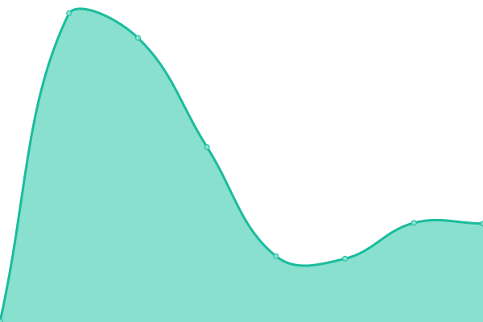
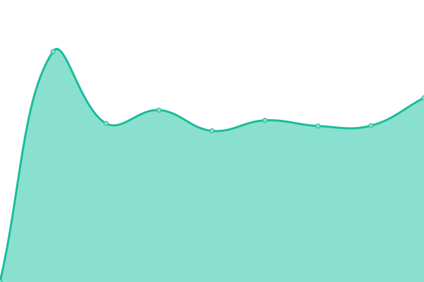

# [📈 Live Status](https://glinet-uptime.admon.in.ua): <!--live status--> **🟧 Partial outage**

This repository contains the open-source uptime monitor and status page for [Aaron Viehl](https://singleton-factory.de), powered by [Upptime](https://github.com/upptime/upptime).

With [Upptime](https://upptime.js.org), you can get your own unlimited and free uptime monitor and status page, powered entirely by a GitHub repository. We use [Issues](https://github.com/admonstrator/glinet-uptime/issues) as incident reports, [Actions](https://github.com/admonstrator/glinet-uptime/actions) as uptime monitors, and [Pages](https://glinet-uptime.admon.in.ua) for the status page.

<!--start: status pages-->
<!-- This summary is generated by Upptime (https://github.com/upptime/upptime) -->
<!-- Do not edit this manually, your changes will be overwritten -->
<!-- prettier-ignore -->
| URL | Status | History | Response Time | Uptime |
| --- | ------ | ------- | ------------- | ------ |
|  [GL.iNet Website (Global)](https://www.gl-inet.com) | 🟩 Up | [gl-i-net-website-global.yml](https://github.com/Admonstrator/glinet-uptime/commits/HEAD/history/gl-i-net-website-global.yml) | 

 481ms
     
 | 

<a href="https://glinet-uptime.admon.in.ua/history/gl-i-net-website-global">100.00%</a>
    

|  [GL.iNet Forum (Global)](https://forum.gl-inet.com) | 🟩 Up | [gl-i-net-forum-global.yml](https://github.com/Admonstrator/glinet-uptime/commits/HEAD/history/gl-i-net-forum-global.yml) | 

 435ms
     
 | 

<a href="https://glinet-uptime.admon.in.ua/history/gl-i-net-forum-global">100.00%</a>
    

|  [GL.iNet Forum (China)](https://forum.glinet.cn) | 🟥 Down | [gl-i-net-forum-china.yml](https://github.com/Admonstrator/glinet-uptime/commits/HEAD/history/gl-i-net-forum-china.yml) | 

 0ms
     
 | 

<a href="https://glinet-uptime.admon.in.ua/history/gl-i-net-forum-china">10.95%</a>
    

<!--end: status pages-->

[**Visit our status website →**](https://glinet-uptime.admon.in.ua)

## 📄 License

- Powered by: [Upptime](https://github.com/upptime/upptime)
- Code: [MIT](./LICENSE) © [Anand Chowdhary](https://anandchowdhary.com), supported by [Pabio](https://pabio.com)
- Data in the `./history` directory: [Open Database License](https://opendatacommons.org/licenses/odbl/1-0/)
